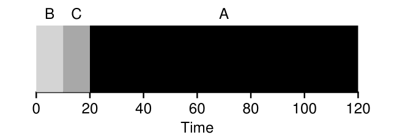

# 🚀 Shortest Job First (SJF) Scheduling

Welcome to the world of Shortest Job First (SJF) scheduling! If FIFO is like a coffee shop line, SJF is like getting the quickest orders out first. ☕️✨

## 🎯 What is SJF?

Shortest Job First (SJF) is a scheduling algorithm that prioritizes jobs based on their length. The shortest job runs first, then the next shortest, and so on. This simple yet effective policy is like a productivity hack for your CPU! 💻🔧

### **Example: Jobs A, B, and C with SJF**

Imagine three jobs:
- **Job A**: Takes 100 seconds
- **Job B**: Takes 10 seconds
- **Job C**: Takes 10 seconds

#### Timeline for SJF Scheduling:

In the timeline:
- Jobs B and C (shorter ones) finish before Job A
- The average turnaround time is improved to:

$$
T_{\text{average}} = \frac{10 + 20 + 120}{3} = 50 \text{ seconds}
$$

That's a significant improvement over FIFO’s 110 seconds! 🎉

## 🚨 The Catch: Late Arrivals

SJF shines when all jobs arrive at the same time, but what happens if jobs don’t all arrive together? 🤔

### **Example: Late Arrivals**

- **Job A:** Arrives at t = 0, runs for 100 seconds
- **Jobs B and C:** Arrive at t = 10, each runs for 10 seconds

#### Timeline for SJF with Late Arrivals:

In this case:
- Jobs B and C must wait for Job A to complete, leading to the same convoy problem we saw with FIFO
- Average turnaround time becomes:

$$
T_{\text{average}} = \frac{100 + (110 - 10) + (120 - 10)}{3} = 103.33 \text{ seconds}
$$

Despite SJF's potential for efficiency, late arrivals can still create delays. So, it’s not always smooth sailing! ⛵️

## 🧠 Key Takeaways

- **SJF** is great for minimizing average turnaround time when jobs arrive simultaneously.
- **Drawback:** It can suffer from the convoy effect if jobs arrive at different times, leading to delays for shorter jobs.

---

*Stick around as we dive into more scheduling algorithms and tackle these tricky scheduling challenges!* 🌟🚀
