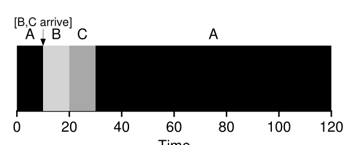

# ⏱️ Shortest Time-to-Completion First (STCF) Scheduling

Welcome to the next level of scheduling awesomeness: Shortest Time-to-Completion First (STCF)! If SJF was a speedy sprinter, STCF is a marathon runner who knows how to pace themselves. 🏃‍♂️💨

## 🎯 What is STCF?

Shortest Time-to-Completion First (STCF) is like SJF's more sophisticated cousin. While SJF queues up jobs and waits, STCF is smart enough to jump in and tackle new, shorter jobs before finishing the current one. It’s like having a really good multitasker on your team! 🧠✨

### **How STCF Works**

STCF doesn’t just let jobs finish once they start. Instead, it:
- **Preempts** the current job if a new job with less time left arrives
- **Switches** to the new job and continues the previous one later

#### Example Scenario

Let's revisit our jobs:
- **Job A:** 100 seconds
- **Jobs B and C:** 10 seconds each

#### Timeline for STCF Scheduling:

With STCF, when Jobs B and C arrive, the scheduler will:
1. **Preempt** Job A
2. **Run** Jobs B and C
3. **Resume** Job A once B and C are done

The average turnaround time for STCF is:

$$
T_{\text{average}} = \frac{(120 - 0) + (20 - 10) + (30 - 10)}{3} = 50 \text{ seconds}
$$

That’s a huge improvement from the FIFO and SJF methods! 🎉👏

## 🔍 Why STCF is So Cool

- **Preemptive Power:** STCF can jump between jobs based on remaining time, handling late arrivals with style.
- **Optimality:** It’s not just effective; it’s provably optimal! If you understand why SJF is optimal when jobs arrive simultaneously, STCF extends that brilliance to more dynamic scenarios. 🏅

## 🧠 Key Takeaways

- **STCF** is an enhancement of SJF with preemption, improving turnaround time and handling late arrivals better.
- **Drawback:** More complex to implement due to frequent context switching, but the performance boost is worth it!

---

*Stick with us as we explore more scheduling strategies and uncover the secrets of efficient job handling!* 🌟🚀
